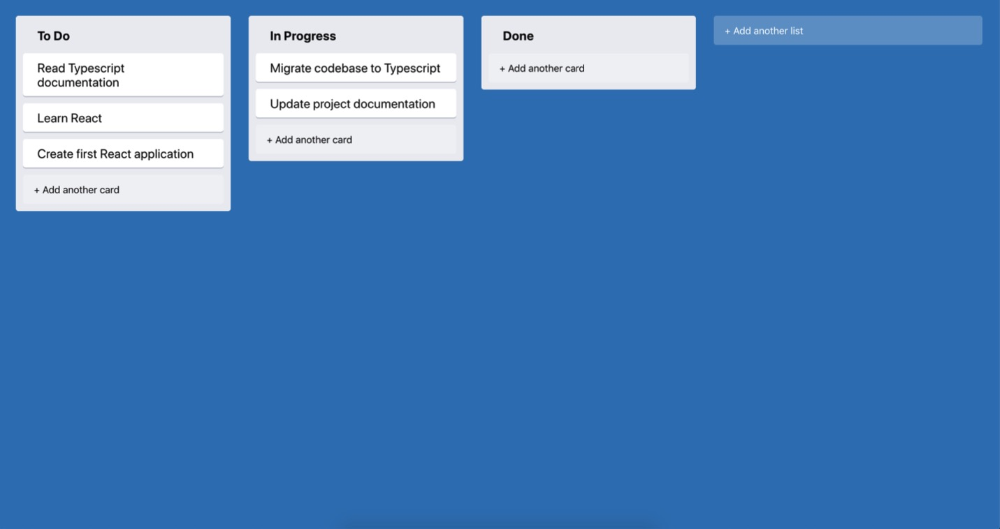

## 第一个React和TypeScript应用：构建可拖拽的Trello
### 介绍
本章我们将创建第一个React + TypeScript应用程序。
使用create-react-app CLI初始化项目文件结构。如果以前使用过React，可能会对这个工具比较熟悉。没有用过也不必担心，本章将展开讨论。
我们先浏览下创建后文件结构并了解每个文件的作用。然后创建组件，了解如何使用TypeScript指定属性（props）。
本章也会介绍如何在TypeScript项目中使用JavaScript库。一些库默认是兼容的，而不兼容的库则需要安装对应的@types包。

下面是本章涉及的内容：

* 创建组件
* 定义属性（props）
* 使用状态（state）
* 为组件添加样式
* 使用外部库
* 创建网络请求

### 预备知识

阅读本章之前需要先了解一些预备知识。

首先，需要了解如何使用命令行。Mac系统默认使用Terminal.app。所有的Linux发行版有预装了终端应用。对于Windows系统，推荐使用Cygwin或者Cmder。经验丰富的读者，也可以使用Windows Subsystem for Linux。

VSCode支持开箱即用TypeScript，推荐用作开发工具。

本书将使用Node 10.16.0或更高的版本。请使用nvm（Mac或Linux）或nvm-windows（Windows）来切换版本。此外还需要了解如何使用node包管理器。在本章的示例中，将使用Yarn，当然也可以使用npm。

需要对React有一定的了解，特别是功能组件和React钩子的有关知识。因为在本例中，我们将不用类组件实现。如有需要，请访问[React Documentation](https://reactjs.org/docs/getting-started.html)以更新知识。

### 我们要创建什么

我们将创建一个简化的看板类应用。选用该类应用中较为流行的Trello作为参考。

**Trello Board**

用户可使用Trello创建任务卡片，通过列表进行组织管理。拖拽操作用于实现卡片和列表重排序。我们还可以对任务进行评论和添加文件。
我们将重建核心功能：创建任务，制作列表和任意拖拽。

### 预览最终结果
下面我们将从零开始构建应用，并在构建过程中对每一个环节进行解释。请时刻留意我们的进度，这有助于我们随时检验结果。

本书附带一个zip格式的压缩包，里面包含了每一步的示例。完整的示例则在code/01-first-app/completed目录下。

cd code/01-first-app/completed

切换到该目录后，使用下面的命令安装依赖并启动应用：

yarn && yarn dev

应用应该会在浏览器中打开，如果没有，可以手动访问http://localhost:3000.

**Final Result**
